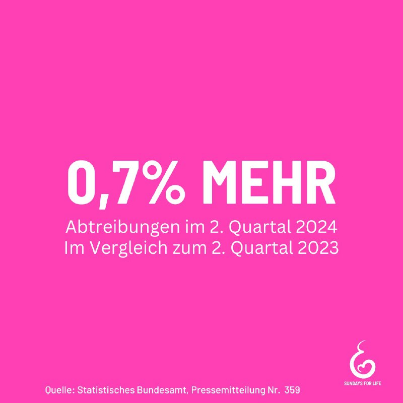

---
author: ""
title: "Im 2. Quartal 2024 wurden in Deutschland rund 26.900 Kinder durch Abtreibung getötet. 47 % davon erfolgten mittels der Absaugmethode.97 % der gemeldeten Abtreibungen wurden nach der Beratungsregelung vorgenommen."
layout: "post"
description: "Im 2. Quartal 2024 wurden in Deutschland rund 26.900 Kinder durch Abtreibung getötet. 47 % davon erfolgten mittels der Absaugmethode.97 % der gemeldeten Abtreibungen wurden nach der Beratungsregelung vorgenommen.'
images: ["/post/Menschenrechte/1727269257/1727269257.jpg"]
categories: ["undefined"]
tags: ["undefined"]
date: 2024-09-26 13:31:19 +0100
summary: "Im 2. Quartal 2024 wurden in Deutschland rund 26.900 Kinder durch Abtreibung getötet. 47 % davon erfolgten mittels der Absaugmethode.97 % der gemeldeten Abtreibungen wurden nach der Beratungsregelung vorgenommen."
linkedsummaryImage: "/post/Menschenrechte/1727269257/1727269257.jpg"]
keepImageRatio: "true"
+++

