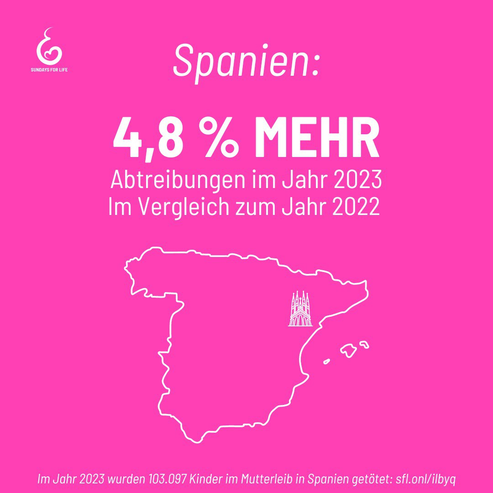

---
title: "Im Jahr 2023 wurden 103.097 Kinder im Mutterleib getötet, 4,8 % mehr als im Vorjahr, so das Gesundheitsministerium. Fast 46,5 % der Frauen hatten zuvor keine Verhütungsmethode angewendet. https://sfl.onl/ilbyq "
categories: ["Menschenrechte", "Menschenwürde", "human rights"]
tags: ["Menschenrechte", "Menschenwürde", "human rights"]
date: 2024-10-17 10:24:51 +0100
summary: "Im Jahr 2023 wurden 103.097 Kinder im Mutterleib getötet, 4,8 % mehr als im Vorjahr, so das Gesundheitsministerium. Fast 46,5 % der Frauen hatten zuvor keine Verhütungsmethode angewendet. https://sfl.onl/ilbyq "
summaryImage: "2024-10-17_10.24.51.jpg"
keepImageRatio: true
draft: false
hideLastModified: false
---