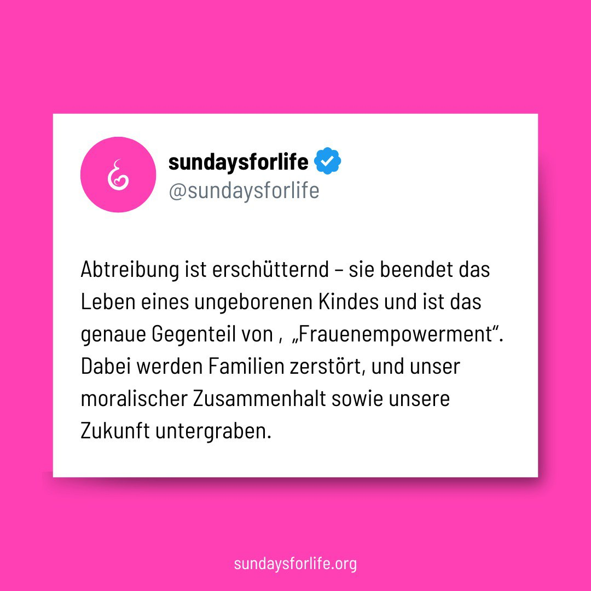

---
title: "Ein echtes „Frauenempowerment“ bedeutet, das Leben zu schützen und Frauen die Möglichkeit zu geben, für das Leben ihrer Kinder einzutreten. "
categories: ["Menschenrechte", "Menschenwürde", "human rights"]
tags: ["Menschenrechte", "Menschenwürde", "human rights"]
date: 2024-11-13 15:53:20 +0100
summary: "Ein echtes „Frauenempowerment“ bedeutet, das Leben zu schützen und Frauen die Möglichkeit zu geben, für das Leben ihrer Kinder einzutreten. "
summaryImage: "2024-11-13_15.53.20.jpg"
keepImageRatio: true
draft: false
hideLastModified: false
---