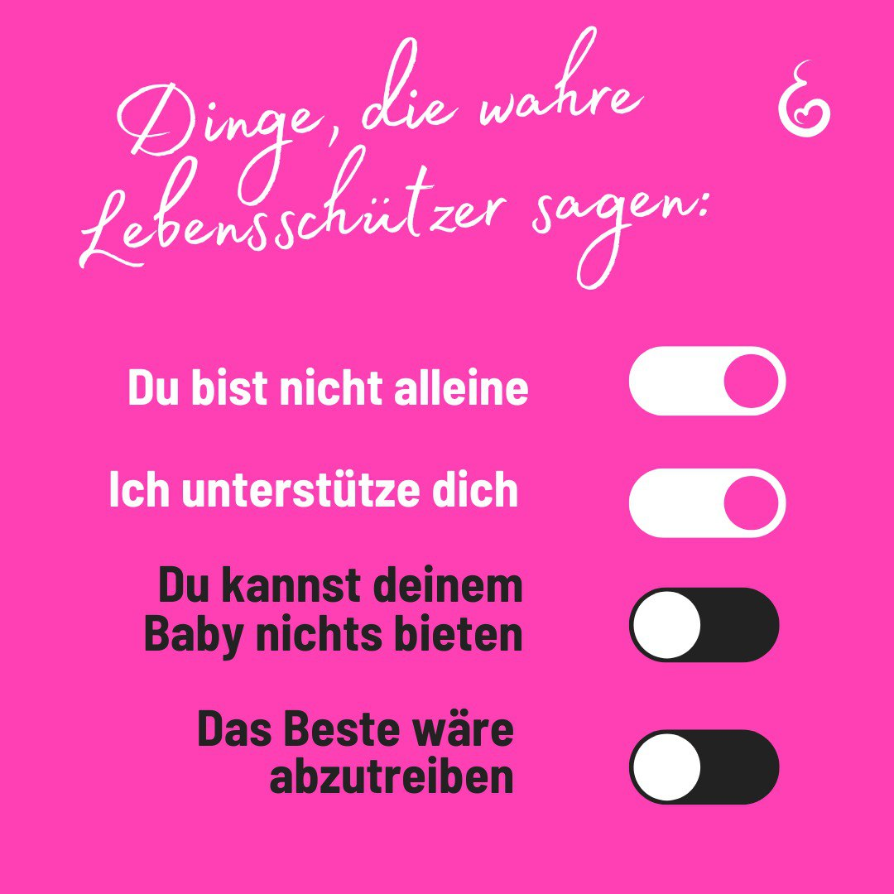

---
title: "Das sind Aussagen, die Mütter in einem Schwangerschaftskonflikt wirklich verdient hätten, anstatt ihnen die Lüge zu verkaufen, dass sie nicht gut genug sind. "
categories: ["Menschenrechte", "Menschenwürde", "human rights"]
tags: ["Menschenrechte", "Menschenwürde", "human rights"]
date: 2024-12-06 14:40:12 +0100
summary: "Das sind Aussagen, die Mütter in einem Schwangerschaftskonflikt wirklich verdient hätten, anstatt ihnen die Lüge zu verkaufen, dass sie nicht gut genug sind. "
summaryImage: "2024-12-06_14.40.12.jpg"
keepImageRatio: true
draft: false
hideLastModified: false
---