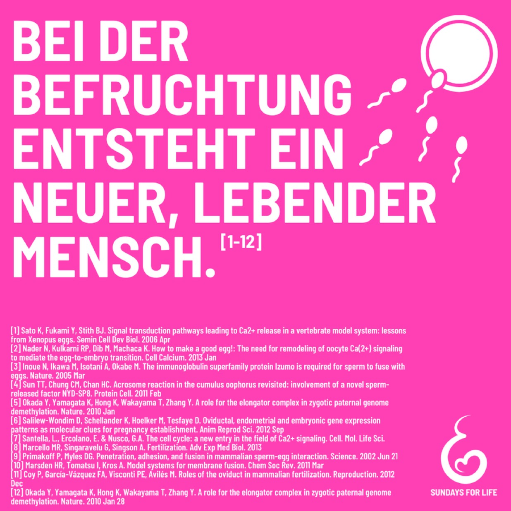

---
title: "Wann das Leben eines Menschen beginnt, ist unstrittig. Die Frage ist, was machen wir jetzt mit dieser Information? "
categories: ["Menschenrechte", "Menschenwürde", "human rights"]
tags: ["Menschenrechte", "Menschenwürde", "human rights"]
date: 2025-01-01 17:57:44 +0100
summary: "Wann das Leben eines Menschen beginnt, ist unstrittig. Die Frage ist, was machen wir jetzt mit dieser Information? "
summaryImage: "2025-01-01_17.57.44.jpg"
keepImageRatio: true
draft: false
hideLastModified: false
---