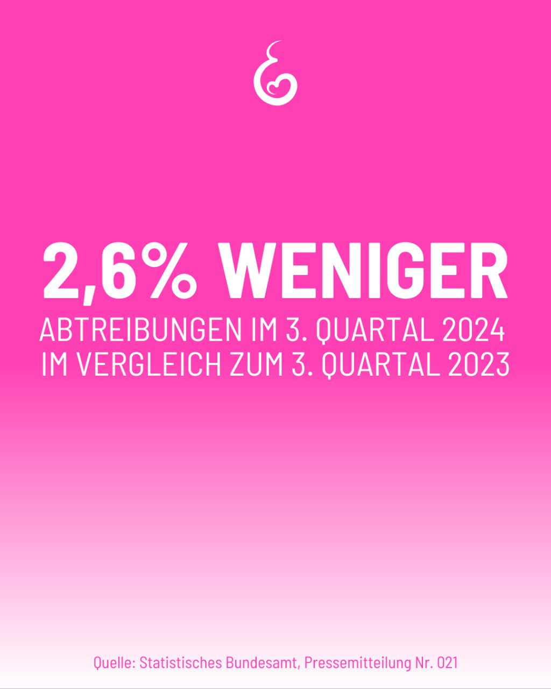

---
title: "Im 3. Quartal 2024 wurden in Deutschland rund 26 000 Kinder durch Abtre1bung getötet.  45 % davon erfolgten mittels der Absaugmethode.  96 % der gemeldeten Abtreibungen wurden nach der Beratungsregelung vorgenommen. "
categories: ["Menschenrechte", "Menschenwürde", "human rights"]
tags: ["Menschenrechte", "Menschenwürde", "human rights"]
date: 2025-02-19 16:09:27 +0100
summary: "Im 3. Quartal 2024 wurden in Deutschland rund 26 000 Kinder durch Abtre1bung getötet.  45 % davon erfolgten mittels der Absaugmethode.  96 % der gemeldeten Abtreibungen wurden nach der Beratungsregelung vorgenommen. "
summaryImage: "2025-02-19_16.09.27.jpg"
keepImageRatio: true
draft: false
hideLastModified: false
---