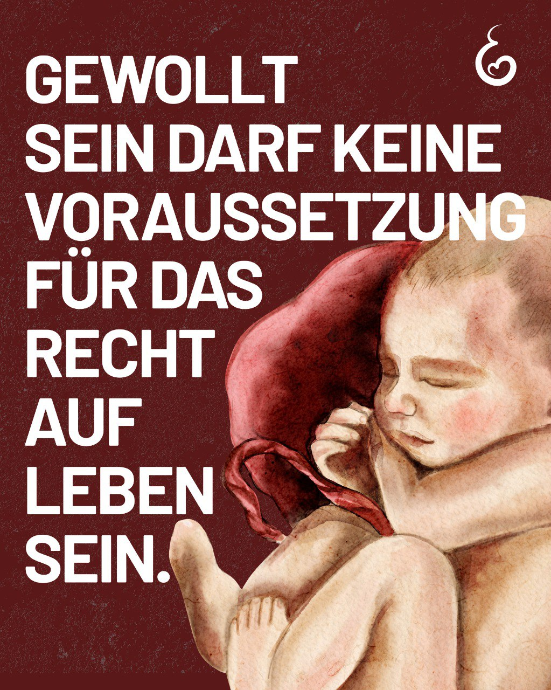

---
title: "Ob geplant oder ungeplant – der Wert eines menschlichen Lebens sollte daran nicht gemessen werden. Jeder Mensch trägt die gleiche Würde und hat das Recht auf Leben."
categories: ["Menschenrechte", "Menschenwürde", "human rights"]
tags: ["Menschenrechte", "Menschenwürde", "human rights"]
date: 2025-04-14 12:48:47 +0100
summary: "Ob geplant oder ungeplant – der Wert eines menschlichen Lebens sollte daran nicht gemessen werden. Jeder Mensch trägt die gleiche Würde und hat das Recht auf Leben."
summaryImage: "2025-04-14_12.48.47.jpg"
keepImageRatio: true
draft: false
hideLastModified: false
---