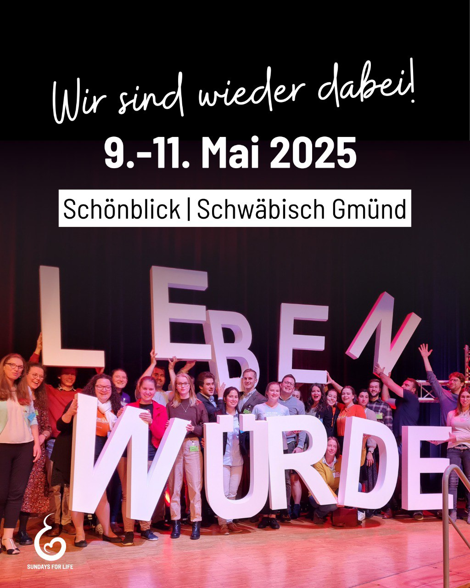

---
title: "Wir freuen uns sehr, Teil des II. Kongresses Leben Würde 2025 sein zu dürfen! In einer Zeit, in der die Würde des Menschen oft gefährdet ist, möchten wir gemeinsam mit anderen Mitstreiterinnen und Mitstreitern ein starkes Zeichen für das Leben setzen."
categories: ["Menschenrechte", "Menschenwürde", "human rights"]
tags: ["Menschenrechte", "Menschenwürde", "human rights"]
date: 2025-04-16 13:43:14 +0100
summary: "Wir freuen uns sehr, Teil des II. Kongresses Leben Würde 2025 sein zu dürfen! In einer Zeit, in der die Würde des Menschen oft gefährdet ist, möchten wir gemeinsam mit anderen Mitstreiterinnen und Mitstreitern ein starkes Zeichen für das Leben setzen."
summaryImage: "2025-04-16_13.43.14.jpg"
keepImageRatio: true
draft: false
hideLastModified: false
---