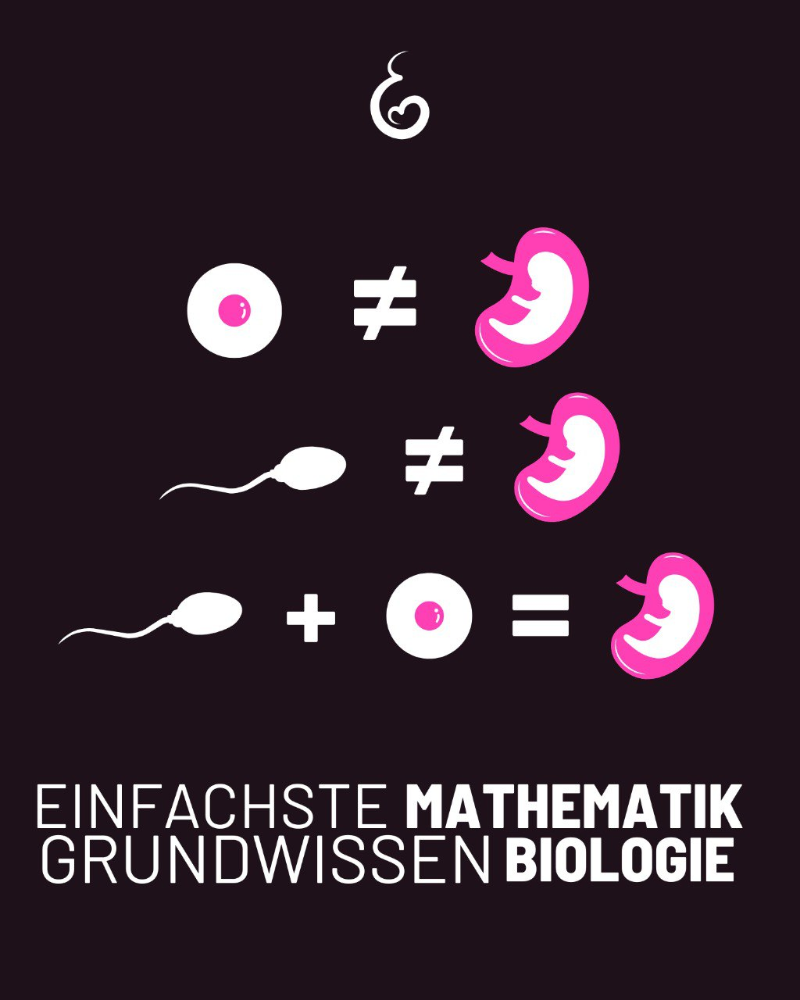

---
title: "Wenn eine Samenzelle und eine Eizelle verschmelzen, entsteht nichts anderes als ein menschlicher Organismus."
categories: ["Menschenrechte", "Menschenwürde", "human rights"]
tags: ["Menschenrechte", "Menschenwürde", "human rights"]
date: 2025-04-18 16:18:47 +0100
summary: "Wenn eine Samenzelle und eine Eizelle verschmelzen, entsteht nichts anderes als ein menschlicher Organismus."
summaryImage: "2025-04-18_16.18.47.jpg"
keepImageRatio: true
draft: false
hideLastModified: false
---