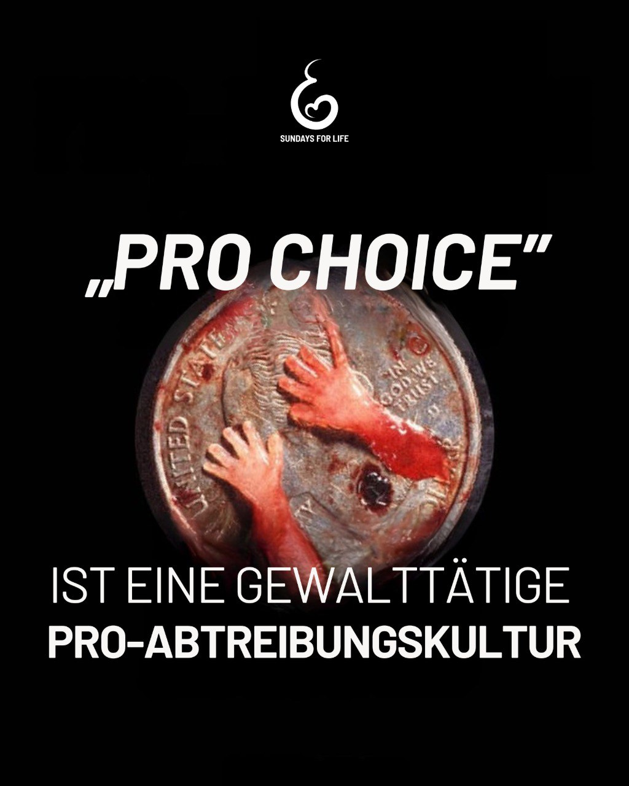

---
title: "Wir wollen keine Kultur, die die gewaltsame Zerstörung ungeborenen Lebens unterstützt. Wir setzen uns für eine Gesellschaft ein, die jeden Menschen als schützenswert anerkennt und schwangeren Frauen in Not echte Hilfe und Hoffnung bietet."
categories: ["Menschenrechte", "Menschenwürde", "human rights"]
tags: ["Menschenrechte", "Menschenwürde", "human rights"]
date: 2025-05-13 12:03:02 +0100
summary: "Wir wollen keine Kultur, die die gewaltsame Zerstörung ungeborenen Lebens unterstützt. Wir setzen uns für eine Gesellschaft ein, die jeden Menschen als schützenswert anerkennt und schwangeren Frauen in Not echte Hilfe und Hoffnung bietet."
summaryImage: "2025-05-13_12.03.02.jpg"
keepImageRatio: true
draft: false
hideLastModified: false
---