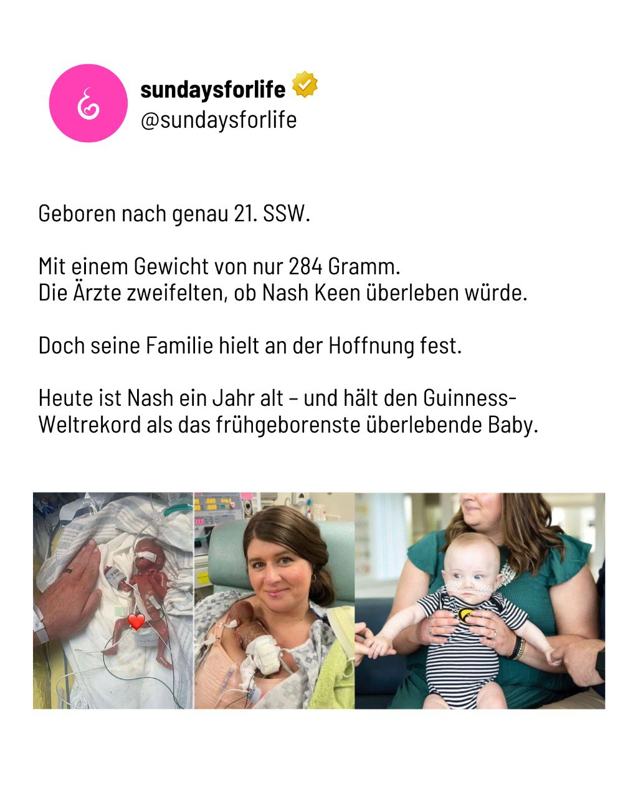

---
title: "Ein Kind wie Nash hätte getötet werden dürfen – nur, weil es noch im Mutterleib war."
categories: ["Menschenrechte", "Menschenwürde", "human rights"]
tags: ["Menschenrechte", "Menschenwürde", "human rights"]
date: 2025-07-30 13:22:18 +0100
summary: "Ein Kind wie Nash hätte getötet werden dürfen – nur, weil es noch im Mutterleib war."
summaryImage: "2025-07-30_13.22.18.jpg"
keepImageRatio: true
draft: false
hideLastModified: false
---