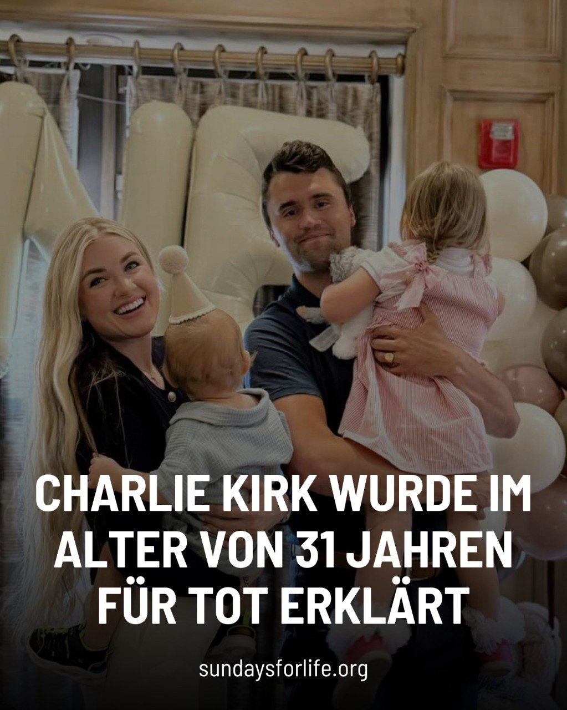

---
title: "Charlie Kirk wurde für tot erklärt, nachdem er an der Utah Valley University angeschossen wurde.  Sein unermüdlicher Einsatz als Lebensschützer wird für immer in Erinnerung bleiben."
categories: ["Menschenrechte", "Menschenwürde", "human rights"]
tags: ["Menschenrechte", "Menschenwürde", "human rights"]
date: 2025-09-11 07:46:16 +0100
summary: "Charlie Kirk wurde für tot erklärt, nachdem er an der Utah Valley University angeschossen wurde.  Sein unermüdlicher Einsatz als Lebensschützer wird für immer in Erinnerung bleiben."
summaryImage: "2025-09-11-07-46-16.jpg"
keepImageRatio: true
draft: false
hideLastModified: false
---