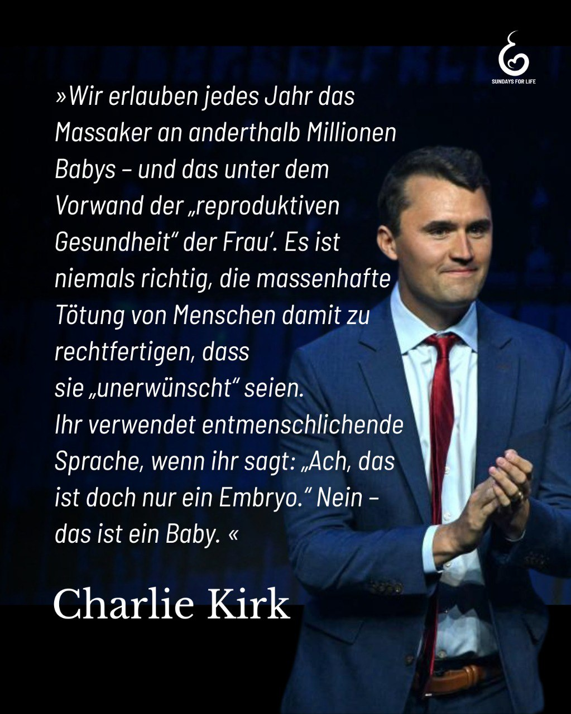

---
title: "Charlie Kirk wird nicht nur als Autor, Podcaster und Aktivist in Erinnerung bleiben, sondern vor allem als eine starke Stimme für das ungeborene Leben. Er hatte den Mut, öffentlich für die auszusprechen, die keine Stimme haben."
categories: ["Menschenrechte", "Menschenwürde", "human rights"]
tags: ["Menschenrechte", "Menschenwürde", "human rights"]
date: 2025-09-13 16:37:24 +0100
summary: "Charlie Kirk wird nicht nur als Autor, Podcaster und Aktivist in Erinnerung bleiben, sondern vor allem als eine starke Stimme für das ungeborene Leben. Er hatte den Mut, öffentlich für die auszusprechen, die keine Stimme haben."
summaryImage: "2025-09-13-16-37-24.jpg"
keepImageRatio: true
draft: false
hideLastModified: false
---