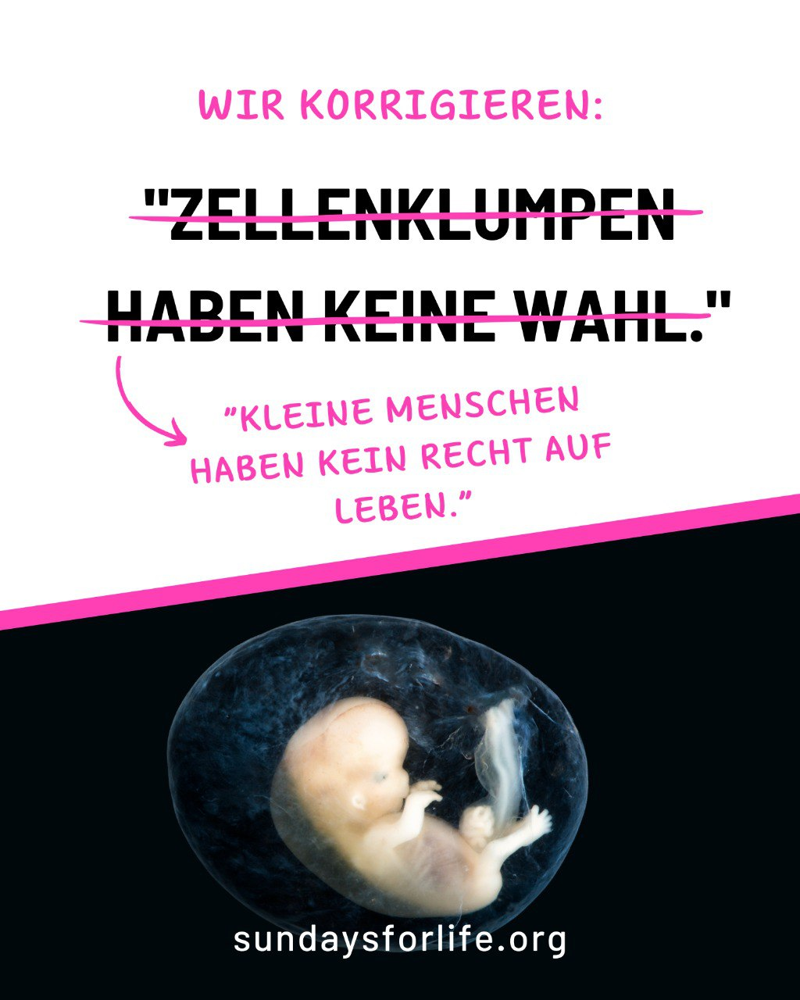

---
title: "Sprache formt, was wir sehen. Abtreibungsbefürworter sprechen von Zellhaufen statt Mensch, von Entscheidung statt Leben."
categories: ["Menschenrechte", "Menschenwürde", "human rights"]
tags: ["Menschenrechte", "Menschenwürde", "human rights"]
date: 2025-10-18 16:57:49 +0100
summary: "Sprache formt, was wir sehen. Abtreibungsbefürworter sprechen von Zellhaufen statt Mensch, von Entscheidung statt Leben."
summaryImage: "2025-10-18-16-57-49.jpg"
keepImageRatio: true
draft: false
hideLastModified: false
---