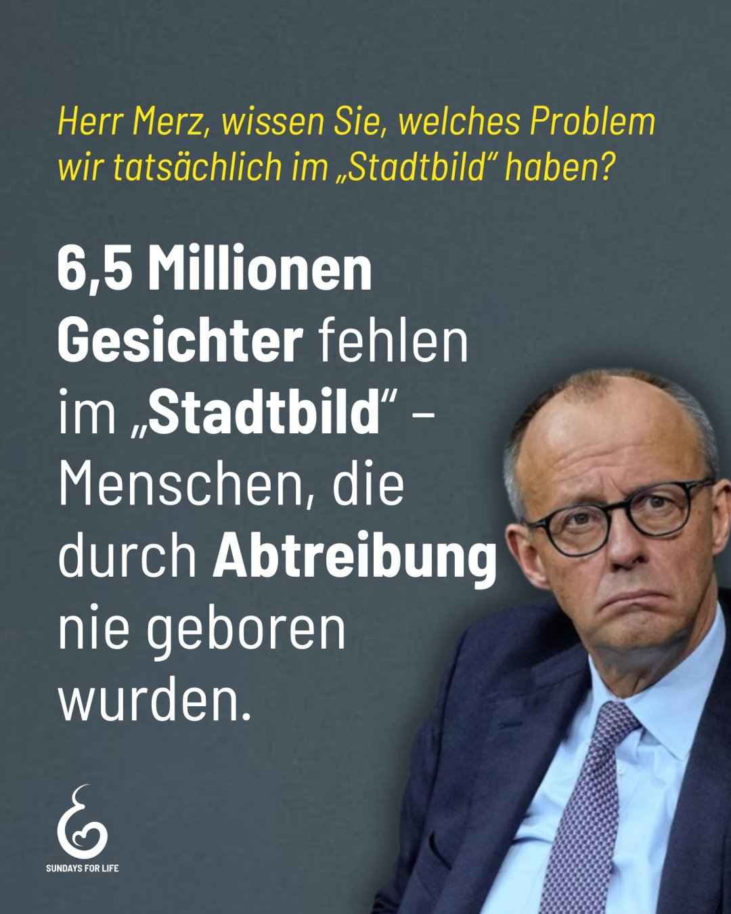

---
title: "Friedrich Merz sprach vom Stadtbild Deutschlands. Doch 6,5 Millionen unsichtbare Gesichter fehlen in diesem Bild – Babys, die seit der Legalisierung der Abtreibung im Jahr 1976 nie Teil unserer Gesellschaft wurden."
categories: ["Menschenrechte", "Menschenwürde", "human rights"]
tags: ["Menschenrechte", "Menschenwürde", "human rights"]
date: 2025-11-06 15:12:18 +0100
summary: "Friedrich Merz sprach vom Stadtbild Deutschlands. Doch 6,5 Millionen unsichtbare Gesichter fehlen in diesem Bild – Babys, die seit der Legalisierung der Abtreibung im Jahr 1976 nie Teil unserer Gesellschaft wurden."
summaryImage: "2025-11-06-15-12-18.jpg"
keepImageRatio: true
draft: false
hideLastModified: false
---