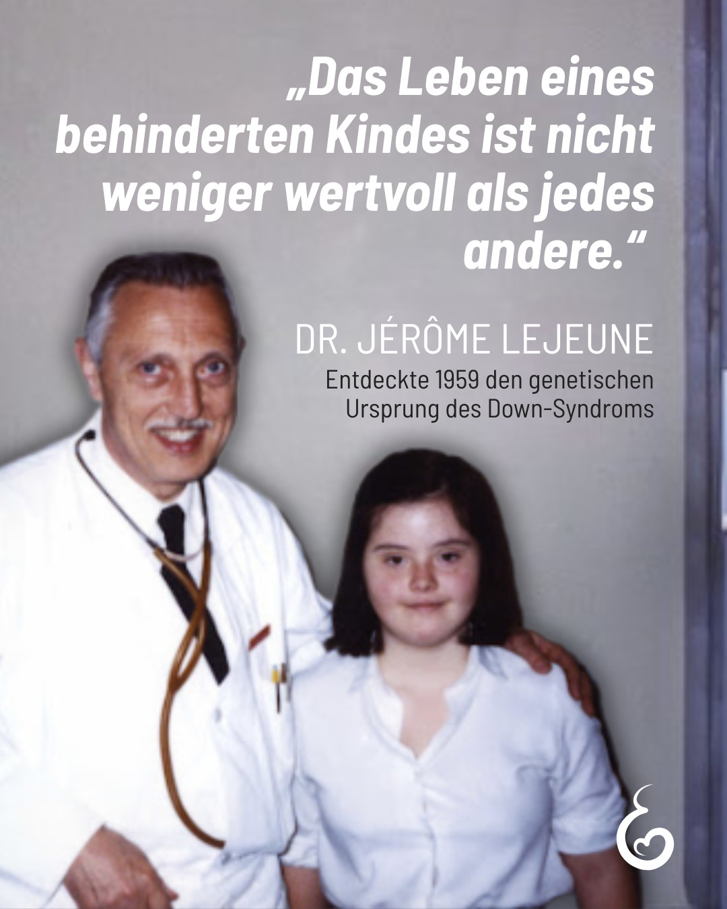

---
title: "Was als wissenschaftlicher Durchbruch gefeiert wurde, verwandelte sich bald in einen Schatten: Seine Entdeckung wurde dazu benutzt, ungeborene Kinder mit Trisomie 21 auszusortieren, bevor sie überhaupt das Licht der Welt sehen durften."
categories: ["Menschenrechte", "Menschenwürde", "human rights"]
tags: ["Menschenrechte", "Menschenwürde", "human rights"]
date: 2026-03-23 08:34:15 +0100
summary: "Was als wissenschaftlicher Durchbruch gefeiert wurde, verwandelte sich bald in einen Schatten: Seine Entdeckung wurde dazu benutzt, ungeborene Kinder mit Trisomie 21 auszusortieren, bevor sie überhaupt das Licht der Welt sehen durften."
summaryImage: "2026-03-23-08-34-15.jpg"
keepImageRatio: true
draft: false
hideLastModified: false
---