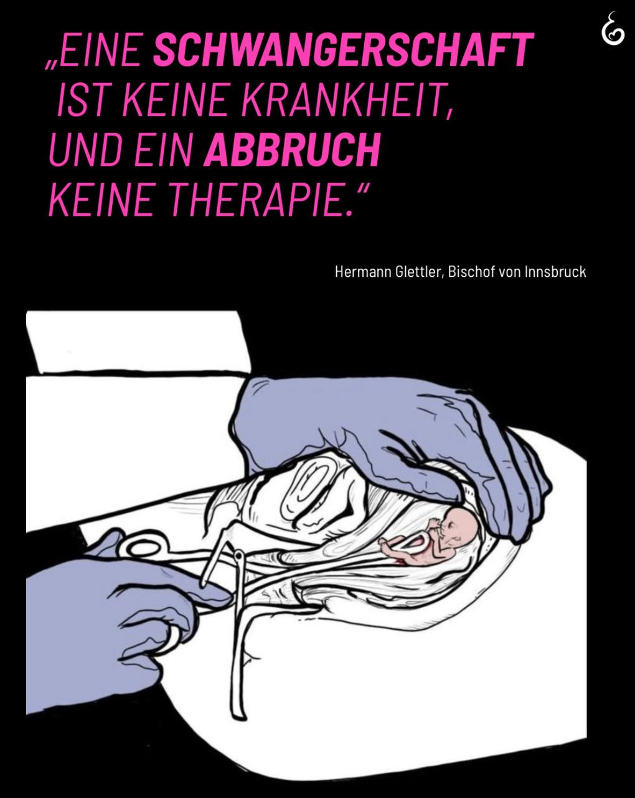

---
title: "Sprache ist nie neutral – sie prägt unser Bild vom Menschen und beeinflusst, wie wir Würde wahrnehmen. Deshalb wollen wir achtsam und verantwortungsvoll sprechen. Denn jedes Wort kann dazu beitragen, den Wert jedes menschlichen Lebens sichtbar zu machen."
categories: ["Menschenrechte", "Menschenwürde", "human rights"]
tags: ["Menschenrechte", "Menschenwürde", "human rights"]
date: 2026-07-08 07:12:47 +0100
summary: "Sprache ist nie neutral – sie prägt unser Bild vom Menschen und beeinflusst, wie wir Würde wahrnehmen. Deshalb wollen wir achtsam und verantwortungsvoll sprechen. Denn jedes Wort kann dazu beitragen, den Wert jedes menschlichen Lebens sichtbar zu machen."
summaryImage: "2026-07-08-07-12-47.jpg"
keepImageRatio: true
draft: false
hideLastModified: false
---